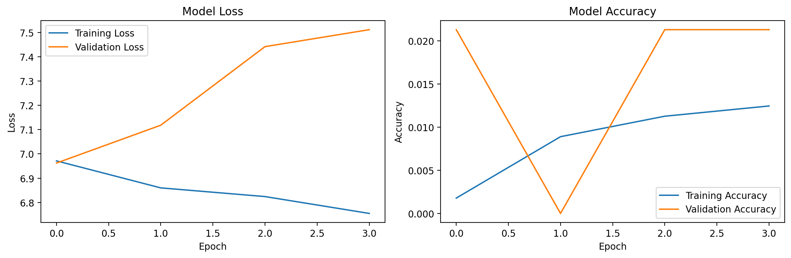

# AI Music Generation with LSTM

This project was developed as part of my CodeAlpha Artificial Intelligence Internship.

The project uses an LSTM neural network to learn musical patterns from MIDI compositions and generate a new sequence of music. The generated output is converted into a playable MIDI file using `music21`.

## Project Overview

A small collection of Bach compositions was loaded from the `music21` corpus and converted into MIDI files for training.

Notes, chords, and their durations were extracted from the MIDI files. These musical events were converted into sequences and used to train a two-layer LSTM model.

After training, the model generated 200 new musical events, which were converted into a MIDI file.

## Project Workflow

1. Load Bach compositions from the `music21` corpus.
2. Convert the compositions into MIDI files.
3. Extract notes, chords, and durations.
4. Create a vocabulary of unique musical events.
5. Prepare input sequences of 50 events.
6. Split the sequences into training and validation data.
7. Build and train an LSTM neural network.
8. Generate a new sequence of musical events.
9. Convert the generated sequence into a MIDI file.
10. Save and evaluate the training history.

## Generated Music

[Download the generated MIDI file](./generated_music.mid)

The MIDI file can be played using software such as VLC Media Player, MuseScore, or another MIDI-compatible application.

## Training Results



The graph shows the training and validation loss and accuracy recorded during model training.

## Model Architecture

The model contains:

- An embedding layer for musical-event representation
- A 256-unit LSTM layer
- A dropout layer
- A 128-unit LSTM layer
- A second dropout layer
- A dense hidden layer
- A softmax output layer for predicting the next musical event

The model was trained using:

- Adam optimizer
- Sparse categorical cross-entropy loss
- Early stopping
- Learning-rate reduction
- Training and validation data split

## Technologies Used

- Python
- TensorFlow
- Keras
- music21
- NumPy
- Matplotlib
- Google Colab
- Jupyter Notebook

## Project Files

```text
.
├── music_generation.ipynb
├── generated_music.mid
├── training-history.png
├── requirements.txt
├── README.md
└── .gitignore
```

## Run the Project

The easiest way to run the project is through Google Colab.

### 1. Open the notebook

Open `music_generation.ipynb` from the repository and select **Open in Colab**.

### 2. Install the required package

```python
!pip install -q music21
```

### 3. Run the notebook

Run each notebook cell in order.

The notebook will:

- prepare the MIDI dataset;
- extract musical events;
- create training sequences;
- build and train the LSTM model;
- generate new music; and
- save the output as `generated_music.mid`.

## Requirements

The project dependencies are listed in `requirements.txt`:

```text
tensorflow
music21
numpy
matplotlib
```

## Limitations

The model was trained on a small set of Bach compositions and for a limited number of epochs. The generated MIDI file therefore demonstrates the complete AI music-generation workflow, but it may contain repetitive or imperfect musical patterns.

The output quality can be improved by:

- using a larger and more diverse MIDI dataset;
- increasing the number of training epochs;
- tuning the model architecture;
- experimenting with different sequence lengths; and
- adjusting the generation temperature.

## Project Status

Completed, trained, tested, and documented.

## Author

**Shayan Akbar**

Developed as part of the CodeAlpha Artificial Intelligence Internship.
